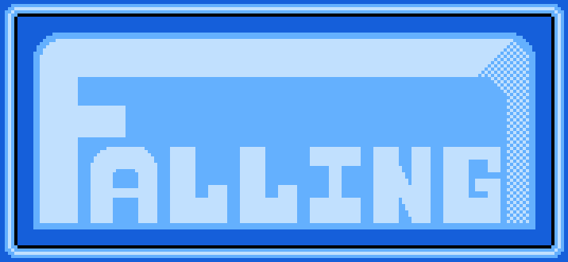

# falling-nes

Falling is a simple NES game written in 6502 assembly.

This is my first go at both assembly programming and designing an entire game from scratch. Start to finish, the project took 130+ hours over 11 days.

### Usage
To play, `falling.nes` can be loaded into an NES emulator such as FCEUX or Bizhawk.
To assemble from source, run `NESASM3 falling.asm` using the NESASM v3.1 assembler (link below).

## References and Resources
- The [Nerdy Nights tutorials](http://nerdy-nights.nes.science/#main_tutorial), especially [Nerdy Nights Sound](http://nerdy-nights.nes.science/#audio_tutorial)
- The [Everynes technical specifications](http://problemkaputt.de/everynes.htm) document
- The [Nesdev Wiki](https://wiki.nesdev.com/w/index.php/Nesdev_Wiki) programming and reference guides

## Utilities
- [NESASM v3.1](http://www.nespowerpak.com/nesasm/NESASM3.zip) for assembling [(source)](https://github.com/camsaul/nesasm)
- [YY-CHR Sprite Editor](https://www.romhacking.net/utilities/119/) for creating sprites and backgrounds

## Other Stuff
### My own docs made during development
- [NES Memory Map](https://docs.google.com/spreadsheets/d/13Y_h6-3DQwdK-3Dvleg-Glk0jn43_As8jPKa08O__bU/edit?usp=sharing)
- [Technical and Programming Reference](https://docs.google.com/document/d/1v2A-L40bzptVRRyk3lBeXLG6chFXZhMmtBnGT7bAvL8/edit?usp=sharing)

### Music
- [Falling - Title Theme](https://soundcloud.com/zenakumusic/falling-title-theme)

## Changelog

### v1.0 [1/6/18]
- Finished original project.

### v1.01 [1/10/19]
- Minor refactoring and difficulty tweaks.

### v1.1 [11/24/19]
- Smoothed out difficulty curve.
    - Adapted movement code for player, obstacles, and pickups to use a basic subpixel system.
    - Difficulty now ramps up in ~50 incremental steps from game start to reach max speed by 255 seconds.
    - Decreased spawn rates of pickups. Spawn rates also increase with difficulty curve.
- Replaced Day mode music with a new track.
